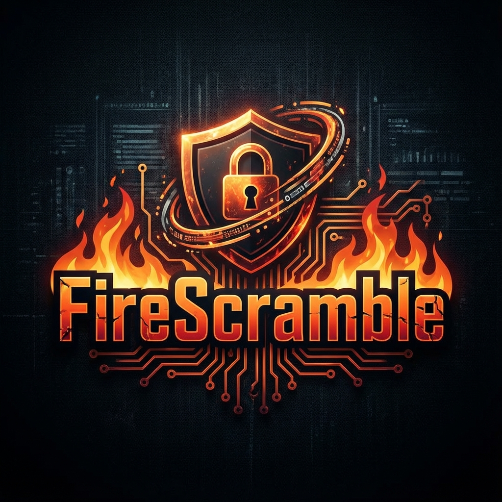

  

<h1 align="center">🔥 FireScramble</h1>

  <strong>Advanced Obfuscation & Encryption for Secure Communication</strong>

  
  
  

  <a href="#-download-android">Download Android</a> •
  <a href="#-web-version-ios--desktop">Web Version (iOS)</a> •
  <a href="#-community">Community</a>

---

## 🛡️ About FireScramble

**FireScramble** is a secure tool designed to encrypt your sensitive data—specifically VPN and proxy configurations (V2Ray, etc.)—into obfuscated **Persian-style codes**.

This unique encoding makes your configs look like normal text or poetry, making them significantly safer to share via SMS or monitored messaging platforms.

> **Privacy First:** Everything runs **100% offline** on your device. We have no servers, no tracking, and no data collection. Trust no one but yourself.

---

## ✨ Features

| Feature | Description |
|---------|-------------|
| 🔐 **FireScramble Algorithm** | Proprietary encryption engine designed for maximum obfuscation. |
| 🇮🇷 **Persian Encoding** | Converts sensitive strings into readable Persian characters to bypass text filters. |
| ⚡ **100% Offline** | No internet connection required. Your data never leaves your device. |
| 🚫 **Zero Tracking** | No analytics, no telemetry, no logs. |
| 📱 **Cross-Platform** | Native Android app + Universal Web App for iOS/PC. |

---

## 📥 Download Android

Get the native application for the best performance on Android devices.

| Requirement | Details |
|-------------|-------|
| **OS** | Android 7.0+ |
| **Architecture** | ARM64, ARMv7, x86_64 |
| **Size** | ~6 MB |

---

## 🌐 Web Version (iOS & Desktop)

Since iOS does not support side-loading easily, **iPhone and iPad users** can enjoy the full experience via our Progressive Web App (PWA).

> **Works on:** iOS (Safari), Windows, macOS, Linux.

---

## 🔒 Security & Algorithm

At the core of this tool is the custom **FireScramble Algorithm**. Unlike standard encryption methods that produce suspicious random characters, FireScramble focuses on **obfuscation**:

1.  **Input:** Your VPN Config (e.g., `vless://...`)
2.  **Process:** Local encryption using the FireScramble Engine.
3.  **Output:** A text string that mimics natural language patterns or scrambled Persian text, reducing the chance of automated flagging by ISP filters.

---

## 📞 Community & Creator

Stay updated with the latest versions and news.

| Platform | Link | Role |
|----------|------|------|
| **Creator** | **ALION** | Lead Developer |
| **Telegram Channel** |  | Updates & News |
| **Telegram Group** |  | Support & Chat |
| **YouTube** |  | Tutorials |

---

  Made with ❤️ & 🔥 by ALION
   
  © 2025 FireScramble. All rights reserved.

